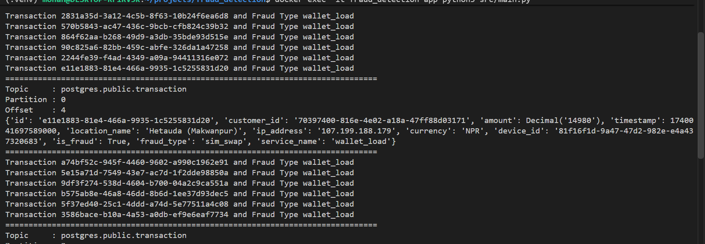

# How to Run the Project

Follow the steps below to set up and run the project locally.

## 1. Clone the Repository

Clone this repository to your local machine:

```bash
git clone https://github.com/MohanDhakal/Fraud-Detection-Pipeline
```

Then enter the project directory:

```bash
cd <project-directory>
```

## 2. Install Docker

Make sure Docker is installed and running on your machine.

You can verify the installation with:

```bash
docker --version
docker compose version
```

## 3. Start the Project

From the root directory of the project, start the required services:

```bash
docker compose up -d
```

Verify that all required containers are running:

```bash
docker ps
```

Make sure the required project containers are up and running before proceeding.

## 4. Verify the Kafka Connect / Debezium Connection

Check that Kafka Connect is running:

```bash
curl http://localhost:8083/
```

A successful response should look similar to:

```json
{
  "version": "3.9.0",
  "commit": "a60e31147e6b01ee",
  "kafka_cluster_id": "5L6g3nShT-eMCtK--X86sw"
}
```

You can also verify that the Debezium connector plugin is available:

```bash
curl http://localhost:8083/connector-plugins
```

The response should contain the PostgreSQL Debezium connector.

## 5. Register the Debezium Connector

From the project root directory, register the PostgreSQL connector using the configuration file:

```bash
curl -X POST   -H "Content-Type: application/json"   --data "@debezium/postgres-connector.json"   http://localhost:8083/connectors
```

The connector configuration is stored in:

```text
debezium/postgres-connector.json
```

## 6. Check the Connector Status

Verify that the connector has started successfully:

```bash
curl http://localhost:8083/connectors/postgres-connector/status
```

The response should show:

```text
connector - state: RUNNING
task - state: RUNNING
```

The connector configuration should correspond to the configuration defined in:

```text
debezium/postgres-connector.json
```

## 7. Start the Producer and Consumers

The project uses `src/main.py` to start the producer and consumers.

Run the following command in **three separate terminals**:

```bash
docker exec -it fraud_detection-app python3 src/main.py
```

Select the following options:

| Terminal | Option | Process |
|---|---:|---|
| First Terminal | `1` | Producer |
| Second Terminal | `3` | Consumer 1 |
| Third Terminal | `4` | Consumer 2 |

### Important

Start the processes in this order:

1. Start **Producer 1** → enter `1`
2. Start **Consumer 1** → enter `3`
3. After confirming that both are running, start **Consumer 2** → enter `4`

## 8. Verify Fraud Detection

The project setup is now ready.

Monitor the application logs to verify that transactions are being processed and that fraudulent transactions are detected.

The fraud detection output should appear in the consumer logs, as shown in the screenshot below.


